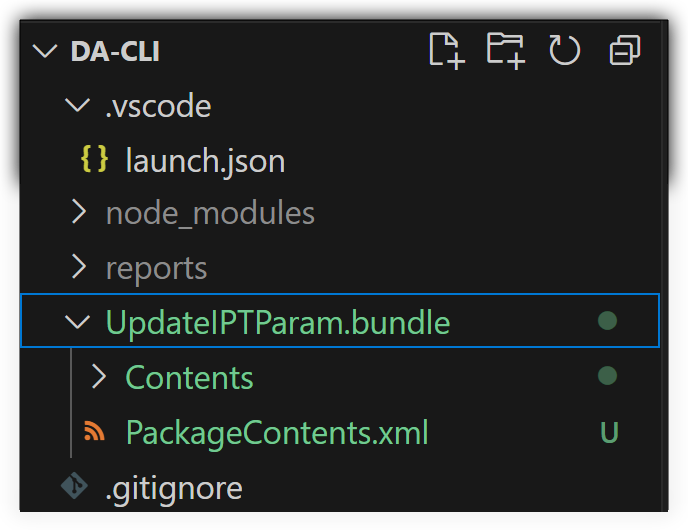

# DA CLI

DA CLI is a command-line interface tool designed to help with Design Automation API tasks.

## Features

Each feature is provided by a different command line option:
- `--token`: create a 3-legged token that will be used if you are running a **work item** that relies on a signed **activity**. You'll just have to open `localhost:8080` in the browser and log in with the user account you want to use. The **access token** will be saved in `token.json` and will be used if needed when running a **work item**.
- `--bundle`: create a new **app bundle** or a new version for an existing **app bundle**. The `appbundle` part of the `config.json` file needs to be filled in correctly.
- `--activity`: create a new **activity** or a new version for an existing **activity**. The `activity` part of the `config.json` file needs to be filled in correctly.
- `--workitem`: run a **work item**. The `workitem` part of the `config.json` file needs to be filled in correctly. The **work item** report files will be saved in the `reports` subfolder of this project.
- `--delete`: delete app, i.e. delete all **app bundles**, **activities** and the **nickname** that was associated with the `clientId` provided in the `credentials` part of the `config.json` file.
- `--key`: create public and private keys. Can only be done on **Windows OS**. It will create two files called `mykey.json` and `mypublickey.json` that will be needed if you want to sign an activity - see `--sign` option. This requires that you download `Das.WorkItemSigner.exe` from [here](https://github.com/autodesk-platform-services/aps-designautomation-signer/releases/) and place it in the root folder of the sample app.
- `--patch`: patch app to set **nickname** and/or **public key** for the **activity**. The `nickname` needs to be set in the `config.json` file. If you want to also set a **public key** then first use the `--key` option that will generate `mypublickey.json`. By deafult the **nickname** of the app is the same as the `clientId` that was used to create it. 
- `--sign`: sign **activity** with private key. Can only be done on **Windows OS**. First the app needs to have a **public key** assigned using `--patch`.  
- `--config <name>`: specify the path of the `config.json` file to use for the operations.

You can find more information about what the `--key`, `--patch` and `--sign` options are doing [here](https://aps.autodesk.com/en/docs/design-automation/v3/developers_guide/3-legged-oauth-token-usage/)

For certain values in the `config.js` file you can use global variables that will be replaced runtime. 
- in `activity.bundles` you can reference `{{nickname}}`
- in `workitem.arguments.<argument name>.headers.Authorization` you can reference `{{accessToken2LO}}` or `{{accessToken3LO}}` 
- in `workitem.arguments.<argument name>.url` you can reference `{{bucketName}}` if you set its value in the config file

If no `Authorization` header is provided for an item in `workitem.arguments` but its `url` value starts with `urn:` then the app will try to generate a **signed url** for it using the **2-legged access token**.

## Usage

As an example the content of `config.json` is set based on the tutorial found [here](https://get-started.aps.autodesk.com/tutorials/design-automation/)

Before using the app follow these steps:
- make sure the **APS app** whose credentials (**client id** / **client secret**) you are using has `http://localhost:8080/callback` added as a `Callback URL` on the [APS website](https://aps.autodesk.com/)
- replace `<client id>` and `<client secret>` everywhere in `config.json` with the correct values - also for `nickname`
- download `UpdateIPTParam.zip` from [here](https://github.com/autodesk-platform-services/aps-design-automation-nodejs/tree/nodejs/bundles) and extract it into the root folder of this sample like so:

- upload `inventor_sample_file.ipt` from [here](https://github.com/autodesk-platform-services/aps-design-automation-nodejs/tree/nodejs/sample%20files) to one of your OSS buckets that belong to the same `clientId` you provided for this project and update `bucketName` in `config.json` with the correct value.

The `launch.json` file contains quite a few start options that can be used from **VS Code**'s **Run and Debug** palette  

## License

This project is licensed under the MIT License.